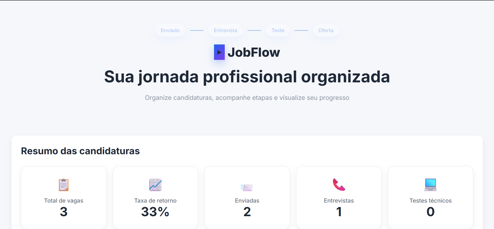
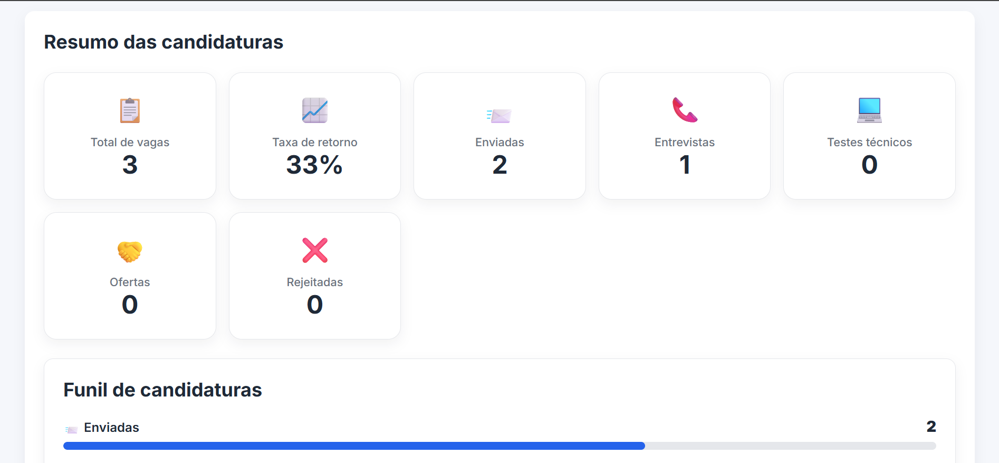
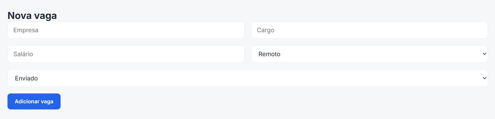
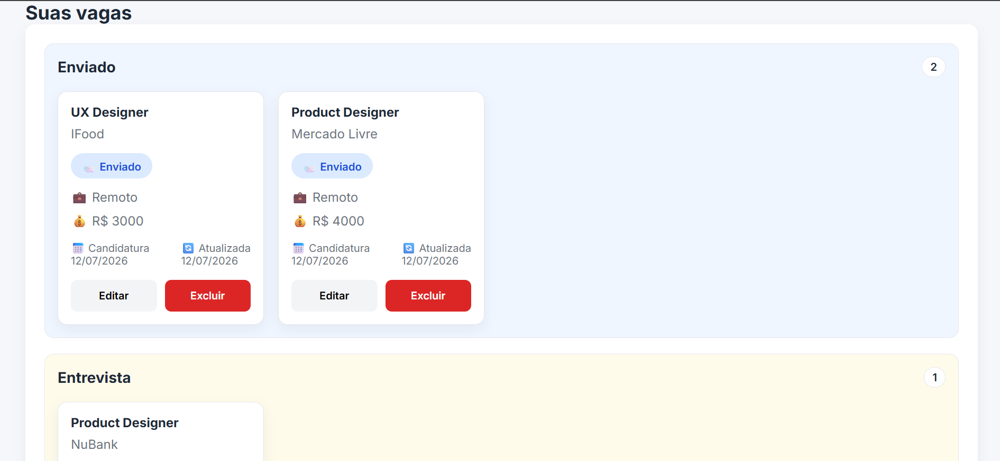

<div align="center">

# 💼 JobFlow

### Uma aplicação de gerenciamento de candidaturas criada com foco em experiência do usuário, organização visual e eficiência no acompanhamento de processos seletivos.

Produto digital desenvolvido para solucionar um problema real de organização de candidaturas, combinando princípios de UX Design, arquitetura de interface e desenvolvimento Front-end.

<br>

[](https://react.dev/)
[](https://www.typescriptlang.org/)
[](https://vitejs.dev/)
[](https://job-flow-demo-1.vercel.app)

### 🚀 **Live Demo**

**https://job-flow-demo-1.vercel.app**

</div>

---

# 📖 Sobre o projeto

Durante uma busca por emprego é comum participar de diversos processos seletivos ao mesmo tempo.

Com isso surgem perguntas como:

- Em quais empresas já me candidatei?
- Qual vaga está em entrevista?
- Quais processos foram encerrados?
- Quando enviei determinada candidatura?

O **JobFlow** foi criado para resolver esse problema centralizando todas essas informações em uma única aplicação.

---

# ✨ Funcionalidades

### 📋 Gerenciamento de vagas

- Cadastro de candidaturas
- Edição de informações
- Exclusão de vagas
- Persistência de dados (Local Storage)

### 🔎 Organização

- Busca por empresa
- Busca por cargo
- Filtro por status

### 📊 Dashboard

- Total de vagas
- Enviadas
- Entrevistas
- Testes técnicos
- Ofertas
- Rejeições
- Taxa de retorno

### 💼 Informações da vaga

- Empresa
- Cargo
- Salário
- Modalidade
- Local da vaga
- Status do processo

---

<h2 align="center">📸 Preview</h2>

<p align="center">
  
  
  </p>

<p align="center">
  
  

</p>

---

# 🛠 Tecnologias

- React
- TypeScript
- Vite
- CSS
- Hooks
- Local Storage

---

# 📂 Estrutura do projeto

```text
src
│
├── components
│
├── hooks
│
├── utils
│
├── constants
│
├── types
│
└── App.tsx
```

---

# 🚀 Executando localmente

Clone o projeto

```bash
git clone https://github.com/danielescheibler/JobFlow.git
```

Entre na pasta

```bash
cd JobFlow
```

Instale as dependências

```bash
npm install
```

Inicie o projeto

```bash
npm run dev
```

---

# 🎯 Roadmap

### ✅ Concluído

- Cadastro de vagas
- Dashboard
- Filtros
- Busca
- Persistência de dados
- Deploy na Vercel
- Componentização
- Hooks customizados

### 🚧 Em desenvolvimento

- Prioridade das vagas
- Observações
- Link da vaga
- Datas relativas
- Melhorias no Dashboard

### 🔮 Futuro

- Drag and Drop
- Exportação CSV
- Exportação PDF
- Tema Dark
- Integração com API
- Login de usuários
- Banco de dados

---

# 💡 Objetivo

Este projeto foi desenvolvido para praticar conceitos modernos de desenvolvimento Front-end utilizando React e TypeScript, simulando uma aplicação baseada em uma necessidade real de candidatos que participam de múltiplos processos seletivos.

Além disso, o projeto demonstra conhecimentos em:

- Componentização
- Organização de código
- Tipagem
- Hooks customizados
- Gerenciamento de estado
- Persistência de dados
- Estrutura escalável
- Boas práticas de desenvolvimento

---

# 👩‍💻 Desenvolvido por

### Daniele Scheibler

Product Designer | UX/UI Designer | Front-end Developer

[](https://www.linkedin.com/in/danielescheibler/)

[](https://github.com/danielescheibler)

📧 danielescheibler@gmail.com

---

<div align="center">

⭐ Se este projeto foi interessante para você, considere deixar uma estrela no repositório.

</div>
